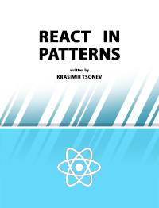

# React in patterns

:books: A free book that talks about design patterns/techniques used while developing with [React](https://facebook.github.io/react/).

## Book

* [GitBook](https://www.gitbook.com/book/krasimir/react-in-patterns/details)
* [Web](https://krasimir.gitbooks.io/react-in-patterns/content/)
* [PDF](https://www.gitbook.com/download/pdf/book/krasimir/react-in-patterns)
* [Mobi](https://www.gitbook.com/download/mobi/book/krasimir/react-in-patterns)
* [ePub](https://www.gitbook.com/download/epub/book/krasimir/react-in-patterns)

## Translations

  * [简体中文](https://github.com/SangKa/react-in-patterns-cn)

## Content

* [In brief](./book/chapter-01/README.md)

### Foundation

* [Communication](./book/chapter-02/README.md)
  * [Input](./book/chapter-02/README.md#input)
  * [Output](./book/chapter-02/README.md#output)
* [Event handlers](./book/chapter-03/README.md)
* [Composition](./book/chapter-04/README.md)
  * [Using React's children API](./book/chapter-04/README.md#using-reacts-children-api)
  * [Passing a child as a prop](./book/chapter-04/README.md#passing-a-child-as-a-prop)
  * [Higher-order component](./book/chapter-04/README.md#higher-order-component)
  * [Function as a children, render prop](./book/chapter-04/README.md#function-as-a-children-render-prop)
* [Controlled and uncontrolled inputs](./book/chapter-05/README.md)
* [Presentational and container components](./book/chapter-06/README.md) 

### Data flow

* [One direction data flow](./book/chapter-07/README.md)
* [Flux](./book/chapter-08/README.md)
  * [Flux architecture and its main characteristics](./book/chapter-08/README.md#flux-architecture-and-its-main-characteristics)
  * [Implementing a Flux architecture](./book/chapter-08/README.md#implementing-a-flux-architecture)
* [Redux](./book/chapter-09/README.md)
  * [Redux architecture and its main characteristics](./book/chapter-09/README.md#redux-architecture-and-its-main-characteristics)
  * [Simple counter app using Redux](./book/chapter-09/README.md#simple-counter-app-using-redux)

### MISC

* [Dependency injection](./book/chapter-10/README.md)
  * [Using React's context (prior to v. 16.3)](./book/chapter-10/README.md#using-reacts-context-prior-v-163)
  * [Using React's context (v. 16.3 and above)](./book/chapter-10/README.md#using-reacts-context-v-163-and-above)
  * [Using the module system](./book/chapter-10/README.md#using-the-module-system)
* [Styling](./book/chapter-11/README.md)
  * [The good old CSS class](./book/chapter-11/README.md#the-good-old-css-class)
  * [Inline styling](./book/chapter-11/README.md#inline-styling)
  * [CSS modules](./book/chapter-11/README.md#css-modules)
  * [Styled-components](./book/chapter-11/README.md#styled-components)
* [Integration of third-party libraries](./book/chapter-12/README.md)
* [React and separation of concerns](./book/chapter-13/README.md)

## Source code

The code samples used in the book are available [here](./code).

## Other resources

* [React Design principles](https://facebook.github.io/react/contributing/design-principles.html)
* [Airbnb React/JSX Style Guide](https://github.com/airbnb/javascript/tree/master/react)
* [React patterns at Planning Center Online](https://github.com/planningcenter/react-patterns)
* [React patterns by Michael Chan](http://reactpatterns.com/)
* [React patterns, techniques, tips and tricks](https://github.com/vasanthk/react-bits)

## Building the book

`yarn install && yarn build`

*To make the ebook generating possible install [calibre](http://calibre-ebook.com/about) and `ln -s /Applications/calibre.app/Contents/MacOS/ebook-convert /usr/local/bin/`.*
