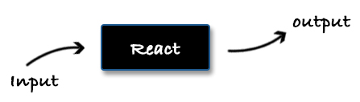

# Communication

Every React component is like a small system that operates on its own. It has its own state, input and output. In the following section we will explore these characteristics.



## Input

The input of a React component is its props. That's how we pass data to it:

```js
// Title.jsx
function Title(props) {
  return <h1>{ props.text }</h1>;
}
Title.propTypes = {
  text: PropTypes.string
};
Title.defaultProps = {
  text: 'Hello world'
};

// App.jsx
function App() {
  return <Title text='Hello React' />;
}
```

The `Title` component has only one input (prop) - `text`. The parent component (`App`) should provide it as an attribute while using the `<Title>` tag. Alongside the component definition we also have to define at least `propTypes`. In there we define the type of every property and React hints us in the console if something unexpected gets sent. `defaultProps` is another useful option. We may use it to set a default value of component's props so that if the developer forgets to pass them we have meaningful values.

React is not defining strictly what should be passed as a prop. It may be whatever we want. It could even be another component:

```js
function SomethingElse({ answer }) {
  return <div>The answer is { answer }</div>;
}
function Answer() {
  return <span>42</span>;
}

// later somewhere in our application
<SomethingElse answer={ <Answer /> } />
```

There is also a `props.children` property that gives us access to the child components passed by the owner of the component. For example:

```js
function Title({ text, children }) {
  return (
    <h1>
      { text }
      { children }
    </h1>
  );
}
function App() {
  return (
    <Title text='Hello React'>
      <span>community</span>
    </Title>
  );
}
```

In this example `<span>community</span>` in `App` component is `children` in `Title` component. Notice that if we don't return `{ children }` as part of the `Title`'s body the `<span>` tag will not be rendered.

(prior v16.3) An indirect input to a component may be also the so called `context`. The whole React tree may have a `context` object which is accessible by every component. More about that in the [dependency injection](../chapter-10/README.md) section.

## Output

The first obvious output of a React component is the rendered HTML. Visually that is what we get. However, because the prop may be everything including a function we could also send out data or trigger a process.

In the following example we have a component that accepts the user's input and sends it out (`<NameField />`).

<span class="new-page"></span>

```js
function NameField({ valueUpdated }) {
  return (
    <input
      onChange={ event => valueUpdated(event.target.value) } />
  );
};
class App extends React.Component {
  constructor(props) {
    super(props);

    this.state = { name: '' };
  }
  render() {
    return (
      <div>
        <NameField
          valueUpdated={ name => this.setState({ name }) } />
        Name: { this.state.name }
      </div>
    );
  }
};
```

Very often we need an entry point of our logic. React comes with some handy lifecycle methods that may be used to trigger a process. For example we have an external resource that needs to be fetched on a specific page.

```js
class ResultsPage extends React.Component {
  componentDidMount() {
    this.props.getResults();
  }
  render() {
    if (this.props.results) {
      return <List results={ this.props.results } />;
    } else {
      return <LoadingScreen />
    }
  }
}
```

Let's say that we are building a search-results experience. We have a search page and we enter our criteria there. We click submit and the user goes to `/results` where we have to display the result of the search. Once we land on the results page we render some sort of a loading screen and trigger a request for fetching the results in `componentDidMount` lifecycle hook. When the data comes back we pass it to a `<List>` component.

## Final thoughts

It is nice that we may think about every React component as a black box. It has its own input, lifecycle and output. It is up to us to compose these boxes. And maybe that is one of the advantages that React offers. Easy to abstract and easy to compose.
