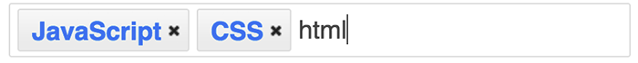

## [React in patterns](../../README.md) / Third-party integration

* [Source code](https://github.com/krasimir/react-in-patterns/tree/master/patterns/third-party/src)

---

React is probably one of the best choices for building UI. Good design, support and community. However, there are cases where we want to use an external service or we want to integrate something completely different. We all know that React works heavily with the actual DOM and basically controls what's rendered on the screen. That's why integrating of third-party components could be tricky. In this article we will see how to mix React and jQuery's UI plugin and do it safely.

## The example

I picked [tag-it](https://github.com/aehlke/tag-it) jQuery plugin for my example. It transforms an unordered list to input field for managing tags:

```html
<ul>
  <li>JavaScript</li>
  <li>CSS</li>
</ul>
```

to:



To make it work we have to include jQuery, jQuery UI and the tag-it plugin code. It works like that:

```jsx
$('<dom element selector>').tagit();
```

We select a DOM element and call `tagit()`.

Now, let's create a simple React app that will use the plugin:

```jsx
// Tags.jsx
class Tags extends React.Component {
  render() {
    return (
      <ul>
      { this.props.tags.map((tag, i) => <li key={ i }>{ tag } </li>) }
      </ul>
    );
  }
};

// App.jsx
class App extends React.Component {
  constructor(props) {
    super(props);

    this.state = { tags: ['JavaScript', 'CSS' ] };
  }
  render() {
    return (
      <div>
        <Tags tags={ this.state.tags } />
      </div>
    );
  }
}
App.propTypes = {
  service: React.PropTypes.object
};

ReactDOM.render(<App />, document.querySelector('#container'));
```

The entry point is our `App` class. It uses the `Tags` component that displays an unordered list based on the passed `tags` prop. When React renders the list on the screen we know that we have a `<ul>` tag so we can hook it to the jQuery plugin.

## Force a single-render

The very first thing that we have to do is to force a single-render. In our case we need `Tags` component rendered only once. That's because when React adds the elements in the actual DOM we want to pass the control of them to jQuery. If we skip this both React and jQuery will work on same DOM elements without knowing for each other. To achieve a single-render we have to use the lifecycle method `shouldComponentUpdate` like so:

```jsx
class Tags extends React.Component {
  shouldComponentUpdate() {
    return false;
  }
  ...
```

By returning `false` here we are saying "Nope, this component will never rerender again". If defined `shouldComponentUpdate` is used by React to understand whether to trigger `render` or not. That's ideal for our case because we want to get the markup on the page using React but we don't want to rely on it after that.

## Initializing the plugin

React gives us an [API](https://facebook.github.io/react/docs/refs-and-the-dom.html) for accessing actual DOM nodes. We have to use the `ref` attribute on a node and later reach that node via `this.refs`. `componentDidMount` is the proper lifecycle method for initializing the tag-it. That's because we get it called when React mounts the result of the `render` method.

```jsx
class Tags extends React.Component {
  ...
  componentDidMount() {
    this.list = $(this.refs.list);
    this.list.tagit();
  }
  render() {
    return (
      <ul ref='list'>
      { this.props.tags.map((tag, i) => <li key={ i }>{ tag } </li>) }
      </ul>
    );
  }
  ...
```

The code above together with `shouldComponentUpdate` lead to React rendering the `<ul>` with two items and then tag-it transforms it to a working tag editing widget.

## Controlling the plugin using React

Let's say that we want to programmatically add a new tag to the already running tag-it field. Such action will be triggered by the React component and needs to use the jQuery API. We have to find a way to communicate data to `Tags` component but still keep the single-render approach.

To illustrate the whole process we will add an input field to `App` component and a button which if clicked will send the input to `Tags`.

```jsx
class App extends React.Component {
  constructor(props) {
    super(props);

    this._addNewTag = this._addNewTag.bind(this);
    this.state = {
      tags: ['JavaScript', 'CSS' ],
      newTag: null
    };
  }
  _addNewTag() {
    this.setState({ newTag: this.refs.field.value });
  }
  render() {
    return (
      <div>
        <p>Add new tag:</p>
        <div>
          <input type='text' ref='field' />
          <button onClick={ this._addNewTag }>Add</button>
        </div>
        <Tags tags={ this.state.tags } newTag={ this.state.newTag } />
      </div>
    );
  }
}
```

We use the internal state of `App` as a data storage for the value of the newly added field. Every time when we click the button we update the state and trigger rerendering of `Tags`. However, because of `shouldComponentUpdate` visually nothing happens inside `Tags`. The only one change is that we get a value of the `newTag` prop which may be captured via another lifecycle method - `componentWillReceiveProps`:

```jsx
class Tags extends React.Component {
  ...
  componentWillReceiveProps(newProps) {
    this.list.tagit('createTag', newProps.newTag);
  }
  ...
```

`.tagit('createTag', newProps.newTag)` is a pure jQuery code.

Here is a full code of the `Tags` component:

```jsx
class Tags extends React.Component {
  componentDidMount() {
    this.list = $(this.refs.list);
    this.list.tagit();
  }
  shouldComponentUpdate() {
    return false;
  }
  componentWillReceiveProps(newProps) {
    this.list.tagit('createTag', newProps.newTag);
  }
  render() {
    return (
      <ul ref='list'>
      { this.props.tags.map((tag, i) => <li key={ i }>{ tag } </li>) }
      </ul>
    );
  }
};
```

## Conclusion

Even though React is manipulating the DOM tree we are able to integrate third-party libraries and services. The available lifecycle methods give us enough control on the rendering process.
